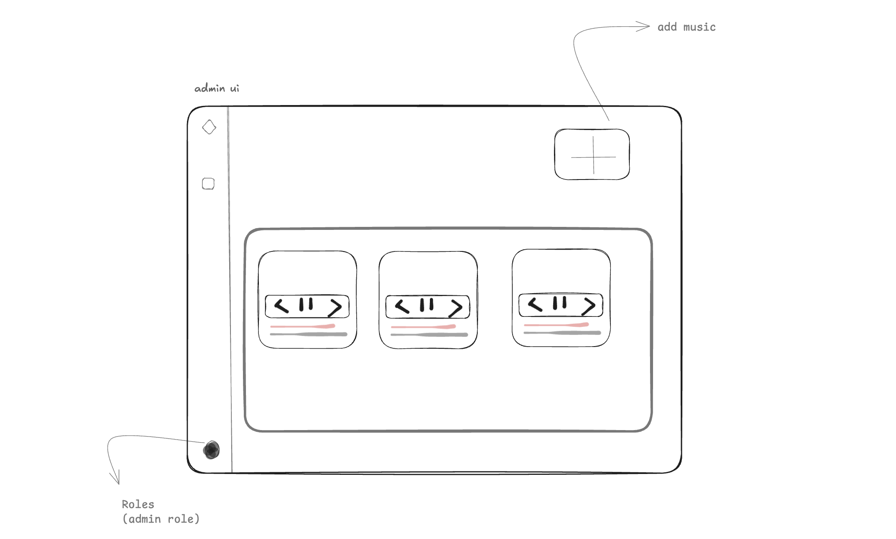
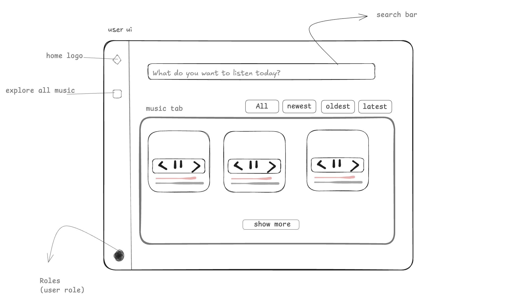

# Music Micro-Frontends – Main App & Music Library

An assignment exploring **Webpack Module Federation** by building a pair of micro-frontends:

• **music-library** – a standalone React + Tailwind application exposing its root component as a remote module.
• **main-app** – the shell / host that dynamically consumes _music-library_ at runtime.

----
This was my very first encounter with Module Federation. I spent roughly **5–6 hours** reading docs, breaking Webpack, fixing version mismatches and _finally_ watching the first remote component render inside the host – a truly satisfying moment! 🎉
------

first i sketch the app 




## Deployed Links

- **Main App (host):** <https://main-music-app-finaacplus.vercel.app/>
- **Music Library (remote):** <https://music-library-finaacplus-manishindiyaars-projects.vercel.app/>

The live Main App pulls the remote's `remoteEntry.js` directly from the Music Library deployment.

## Folder Structure

```text
.
├── main-app/          # The host (port 3000)
└── music-library/     # The remote (port 3003)
```

Each sub-project is a complete React application with its own `webpack.config.js`, `tailwind.config.js` and `package.json`.

## Local Development

1. Clone the repository and `cd` into it.

2. Start the remote (port 3003):
   ```bash
   cd music-library && npm start
   ```
3. In a new terminal start the host (port 3000):
   ```bash
   cd main-app && npm start
   ```
4. Visit <http://localhost:3000> – you should see the **Main App** seamlessly rendering the **Music Library** UI via Module Federation.


## Tech Stack

- React 18
- Webpack 5 + Module Federation
- Tailwind CSS
- TypeScript (via Babel)


Happy hacking & enjoy the music! 🎧